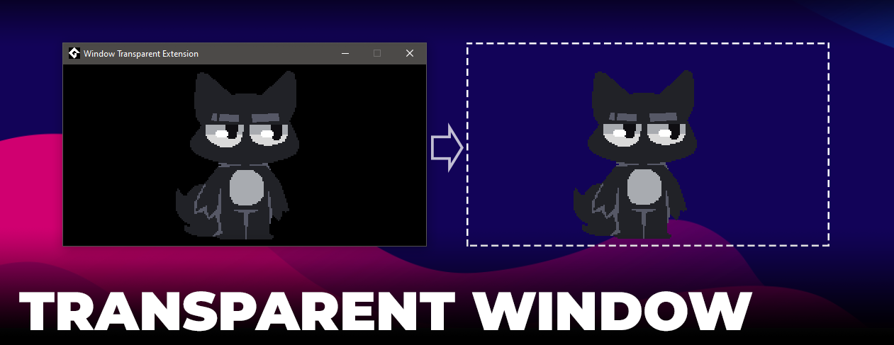
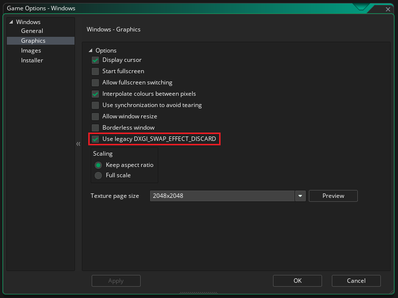

A simple extension that allows you to disable the visibility of a window and show it on top of other windows

## Before usage
Если вы используете версию IDE **2024.14.2.213** и выше, для работы расширения необходимо включить пункт `Use legacy DXGI_SWAP_EFFECT_DISCARD` в настройках игры `Windows -> Graphics`

## Использование
`window_set_transparent( enable ) -> undefined`  
Позволяет **включать** или **выключать** видимость ( прозрачность ) окна

`window_get_transparent( ) -> Bool`  
Возвращает bool значение ( `true` / `false` ) в зависимости от текущего состояния режима прозрачности окна

`window_set_topmost( enable ) -> undefined`  
Позволяет включать или выключать видимость окна поверх других окон ( Даже если окно вне фокуса, оно будет отображаться выше всех остальных )

`window_get_topmost( ) -> Bool`  
Возвращает bool значение ( `true` / `false` ) в зависимости от того, включен ли режим видимости текущего окна поверх других окон
